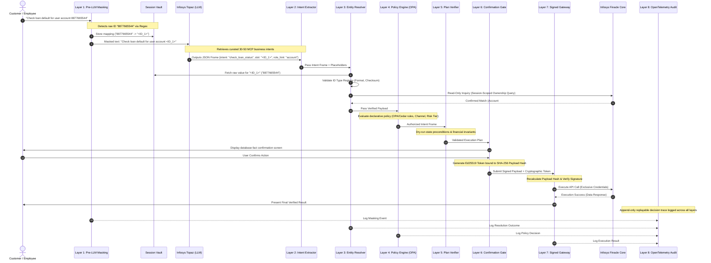
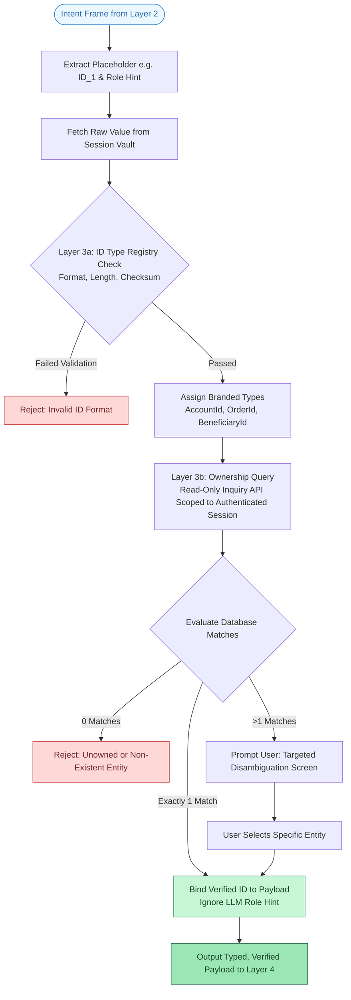
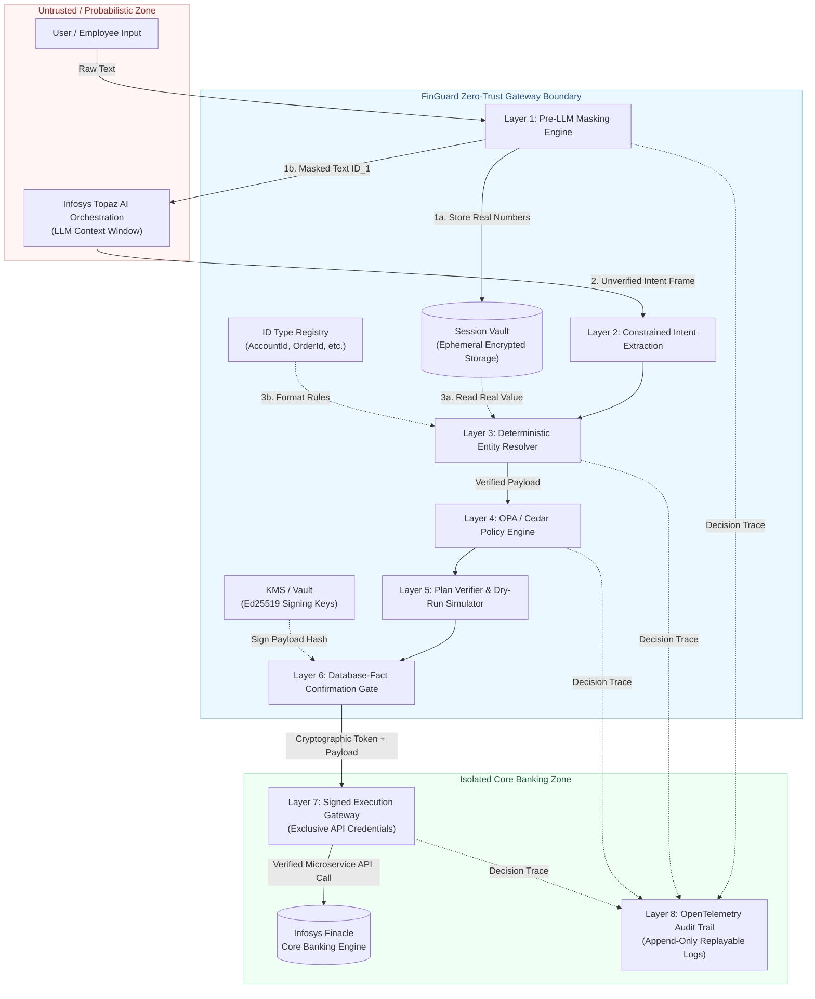

# InTopacle-VR (FinGuard) Architecture Diagrams

This document contains native **Mermaid.js** source code diagrams for the **InTopacle-VR Zero-Trust Gateway**. These scripts render natively in GitHub, GitLab, and Markdown visualizers.

---

## Diagram 1: Complete 8-Layer Request Processing Sequence

---

## Diagram 2: Layer 3 Deterministic Entity Resolver Decision Logic

---

## Diagram 3: InTopacle-VR Zero-Trust Security Boundary Map

